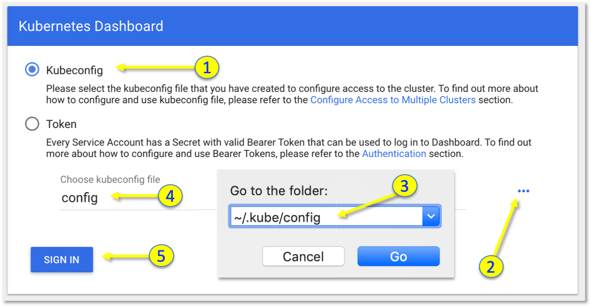
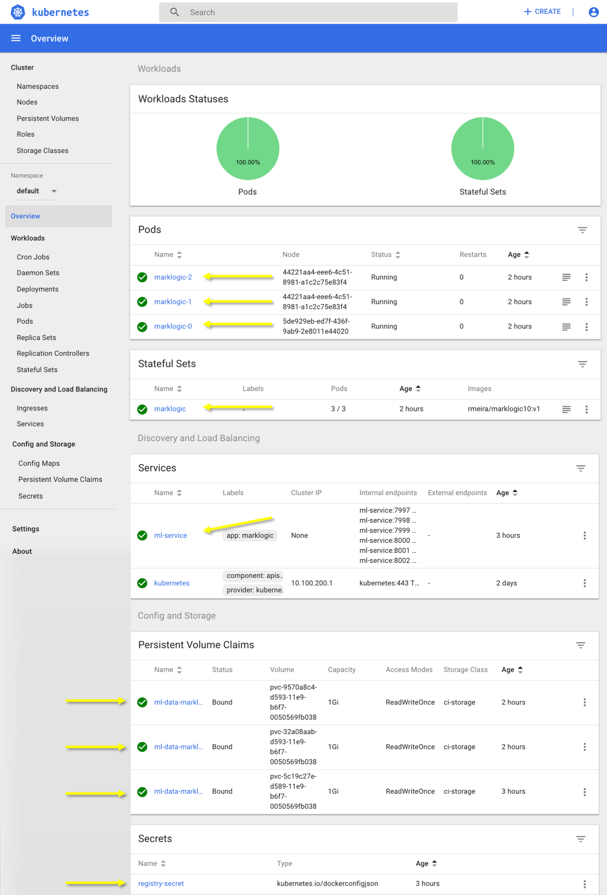
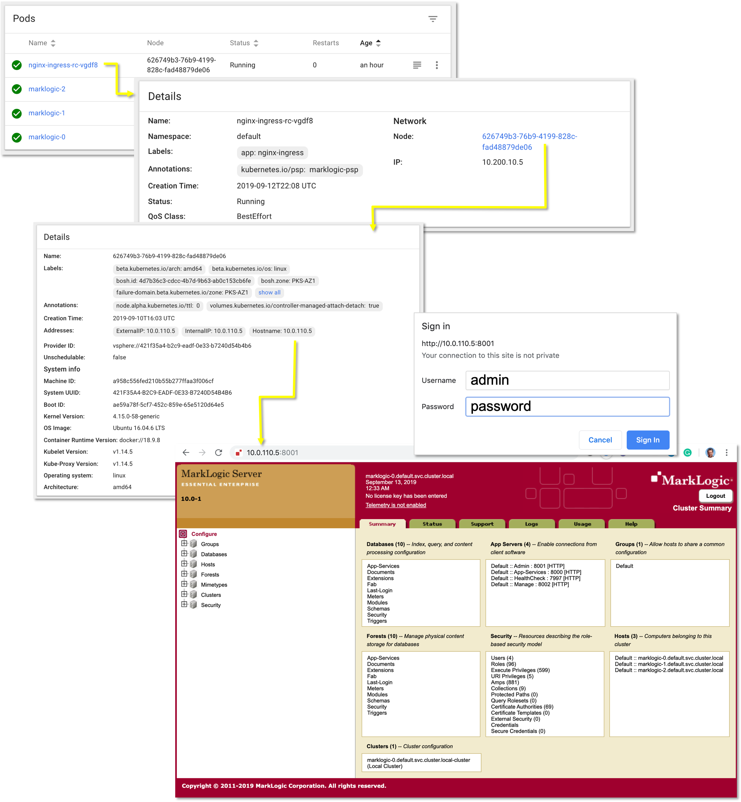

# Instructions for installing MarkLogic on a PKS K8s Cluster

- These instructions will guide you through the steps necessary to perform a [MarkLogic](https://www.marklogic.com/) v10.0.1 installation on a [PKS](https://pivotal.io/platform/pivotal-container-service) v1.5.0 Kubernetes v1.14.5 Cluster 
- I'm using a Mac (not a Windows PC) and following the instructions in [Bill Miller's blog](https://www.marklogic.com/blog/docker-deploy-kubernetes/) with some slight variations to accommodate my target environment
- You will need to have Docker Desktop Community v2.1.0.2 (37877), or a later version, on your Mac if you wish to build the MarkLogic DB and the Nginx Ingress container images. This is an optional step because both images are also available under my public Docker Hub directory.

## 1. Start by cloning this repo into a `/work` directory:

```
mkdir -p /work; cd /work
git clone https://github.com/rm511130/marklogic
cd /work/marklogic
```

## 2. (Optional) Creation of MarkLogic Docker Image

- You can skip step #2 by opting to use the [Marklogic v10 Image](https://cloud.docker.com/u/rmeira/repository/docker/rmeira/marklogic10) I have already built. The scripts we will be using later on, already point to the Docker Images in my Docker Hub repo.

- If you'd like to build your own Docker Image of Marklogic, then follow the instructions below.
- First, you will need to downlad [MarkLogic-10.0-1.x86_64.rpm](https://developer.marklogic.com/products/marklogic-server/10.0) directly from [MarkLogic's Product Web site](http://developer.marklogic.com/products) and this step will entail creating a MarkLogic user account.
- If you open the [Dockerfile](https://github.com/rm511130/MarkLogic/blob/master/Dockerfile) in this folder, you will see that it points to a `MarkLogic-10.0-1.x86_64.rpm` file which must exist in the same `/work/marklogic` directory. When you download the `.rpm` file its name or version may have changed, so you'll need to update your Dockerfile contents to match the new name.
- You can find more details [here](https://www.marklogic.com/blog/docker-deploy-kubernetes/) about the four initialization scripts `mlconfig.sh`, `entry-point.sh`, `setup-child.sh` and `setup-master.sh` used by the Dockerfile to create the MarkLogic v10 Docker Image. Please look through [`mlconfig.sh`](https://github.com/rm511130/MarkLogic/blob/master/mlconfig.sh) because it contains passwords you may wish to change.
- The specific `docker build` and `docker push` commands shown below serve to create a [MarkLogic Docker Image](https://cloud.docker.com/u/rmeira/repository/docker/rmeira/marklogic10) in my (rmeira) public Docker Hub repo. You should replace the `rmeira` part of the commands with your own Docker Username.

```
cd /work/marklogic
docker build -t rmeira/marklogic10:v1 .   # the dot is important, do not delete it
docker push rmeira/marklogic10:v1
```

- Check your [Docker Hub](https://hub.docker.com/) repo to make sure your `marklogic10` image was uploaded properly.

## 3. (Optional) Creation of an Nginx Ingress Controller Docker Image 

- Just like in the previous step #2, you can simply opt to use the [Nginx Docker Image](https://cloud.docker.com/u/rmeira/repository/docker/rmeira/marklogic-nginx) I've already built. If you plan to do so, go ahead and skip to step #4. There's no need to download anything, because the scripts we will be using already point to my `rmeira/marklogic-nginx` docker image.

- If you'd like to build your own Nginx Docker Image, then follow the instructions below.
- Execute `cd /work/marklogic/nginx` and take a look at `nginx` subdirectory. There's a [Dockerfile](https://github.com/rm511130/MarkLogic/blob/master/nginx/Dockerfile) that describes how to build an Nginx Ingress controller Docker Image. Make sure to replace `rmeira` with your own Docker Username before executing the commands below.

```
cd /work/marklogic/nginx
docker build -t rmeira/marklogic-nginx:v1 .   # the dot is important
docker push rmeira/marklogic-nginx:v1
cd /work/marklogic
```

- Note that the Dockerfile instructs the build process to copy [`nginx.conf`](https://github.com/rm511130/MarkLogic/blob/master/nginx/nginx.conf) and [`upstream-defs.conf`](https://github.com/rm511130/MarkLogic/blob/master/nginx/upstream-defs.conf). You should take a quick look at these two files.
- Check your [Docker Hub](https://hub.docker.com/) repo to make sure your `marklogic-nginx` image was uploaded properly.

## 4. Creation of a Kubernetes Cluster

- I'm leveraging an existing PKS installation in the `pcf4u.com` domain, so the process to create a small K8s Cluster is quite simple. We will be creating a cluster called `small` using a PKS plan called `small` that was pre-configured with one Master Node and three Worker Nodes:

```
pks login --api https://api.pks.pcf4u.com -k -u pks_admin -p password
pks create-cluster small --plan small --num-nodes 3 --external-hostname small.pks.pcf4u.com
```

- A DNS entry was made to map `small.pks.pcf4u.com` to `10.0.110.1`, that is, the first available IP address in the PKS Infrastructure Network defined in the Bosh Director and PKS Tiles in Pivotal's Ops Manager UI.

```
nslookup small.pks.pcf4u.com
```
```
Server:		1.1.1.1
Address:	1.1.1.1#53

Non-authoritative answer:
Name:	small.pks.pcf4u.com
Address: 10.0.110.1
```

- The `pks create cluster` command will take several minutes to complete. You can check the status of your cluster by proceeding as follows:

```
pks cluster small  
```

- You should wait until you see `CREATE` and `succeeded` as shown below:

```
PKS Version:              1.5.0-build.32
Name:                     small
K8s Version:              1.14.5
Plan Name:                small
UUID:                     d08412d5-835b-47e3-83a3-eedb549ab892
Last Action:              CREATE
Last Action State:        succeeded
Last Action Description:  Instance provisioning completed
Kubernetes Master Host:   small.pks.pcf4u.com
Kubernetes Master Port:   8443
Worker Nodes:             8
Kubernetes Master IP(s):  10.0.110.1
Network Profile Name:
```

- Once the cluster has been successfully created, we can proceed to request the `small` cluster credentials so we can issue Kubectl commands:

```
pks get-credentials small
```
- You should see a message similar to the following example:

```
Fetching credentials for cluster small.
Context set for cluster small.

You can now switch between clusters by using:
$kubectl config use-context <cluster-name>
```

- Let's verify if the `kubectl` command is working:

```
kubectl cluster-info
```
- You should see a message similar to the following example:

```
Kubernetes master is running at https://small.pks.pcf4u.com:8443
CoreDNS is running at https://small.pks.pcf4u.com:8443/api/v1/namespaces/kube-system/services/kube-dns:dns/proxy
``` 

## 5. Registry Secret

- The [`registry-secret.yml`](https://github.com/rm511130/MarkLogic/blob/master/registry-secret.yml) contains instructions that need to be followed for the creation of your specific `dockerconfigjson` base64 secret.

- In my case, I had to execute and use the output to alter my `registry-secret.yml` file:

```
openssl base64 -in ~/.docker/config.json -out ~/.docker/config_base64.txt
cat ~/.docker/config_base64.txt
```

- The registry-secret information is referenced by the [stateful-set.yml](https://github.com/rm511130/MarkLogic/blob/master/stateful-set.yml) definition. We will be using [`registry-secret.yml`](https://github.com/rm511130/MarkLogic/blob/master/registry-secret.yml) when we get to step #9.

## 6. Defining a Pod Security Policy, a Cluster Role and a Cluster Role Binding:

- Execute the following commands:

```
kubectl create -f marklogic-PodSecurityPolicy.yml
kubectl create -f marklogic-ClusterRole.yml
kubectl create -f marklogic-ClusterRoleBinding.yml
```

- These commands allow the creation of the objects needed to run MarkLogic on K8s.

## 7. StorageClass Definition

- In order to give Pods persistent disk space, we need to issue Persistent Volume Claims which will reference a StorageClass. You can look for existing StorageCLasses using the command below:

```
kubectl describe storageclasses.storage.k8s.io
```

- We will go ahead and create a StorageClass called `ci-storage` which will require the use of a StorageClass yaml definition file.

  - If your K8s cluster is running on a vSphere environment, validate the contents of [vSphere-storageclass.yml](https://github.com/rm511130/MarkLogic/blob/master/vSphere-storageclass.yml) and use it in the following command:
  
  ```
  kubectl create -f vSphere-storageclass.yml
  ```
  
  - If your K8s cluster were running on an AWS environment, you would use [aws-storageclass.yml](https://github.com/rm511130/MarkLogic/blob/master/aws-storageclass.yml) in the following command:
  
  ```
  kubectl create -f aws-storageclass.yml
  ```

## 8. Accessing the Kubernetes Dashboard

- Using a terminal window that needs to remain open, execute the following command to access your K8s Dashboard:

```
kubectl proxy --port=9999
```
- Open a browser using the following URL:

```
http://localhost:9999/api/v1/namespaces/kube-system/services/https:kubernetes-dashboard:/proxy/#!/overview
```

- When challenged to sign-in, follow the five steps shown below:



- Leave the browser open and proceed to step #9.


## 9. Creating a MarkLogic v10 DB on K8s 

- Using the `small` K8s cluster, we need only execute the following commands:

```
cd /work/marklogic                      
kubectl create -f registry-secret.yml
kubectl create -f ml-service.yml
kubectl create -f stateful-set.yml
```

- Wait until you see the nine objects below (next to the yellow arrows), before proceeding with step #10. You will see a _pod has unbound immediate PersistentVolumeClaims_ error message. Not to worry. Wait ~5 minutes and you will see that the message goes away once all the K8s objects are up and running.




## 10. Creating an Ingress Controller for our MarkLogic v10 on K8s 

- Execute the following commands:

```
cd /work/marklogic/nginx
kubectl create -f nginx-ingress.rc.yml
```

- And wait until you see:

   - a working nginx-rc ingress Pod
   - a working nginx-ingress-rc Replication Controller

## 11. Now let's take a look at MarkLogic's Admin GUI

- Follow the steps shown below:



- The MarkLogic Admin Interface enables you to:

   - Manage basic software configuration
   - Create and configure groups
   - Create and manage databases
   - Create and manage new forests
   - Back up and restore forest content
   - Create and manage new web server and Java-language access paths
   - Create and manage security configurations
   - Tune system performance
   - Configure namespaces and schemas
   - Check the status of resources on your systems


## 12. Delete Everything and Clean-up

```
pks login --api https://api.pks.pcf4u.com -k -u pks_admin -p password
pks delete-cluster small                                             
```


